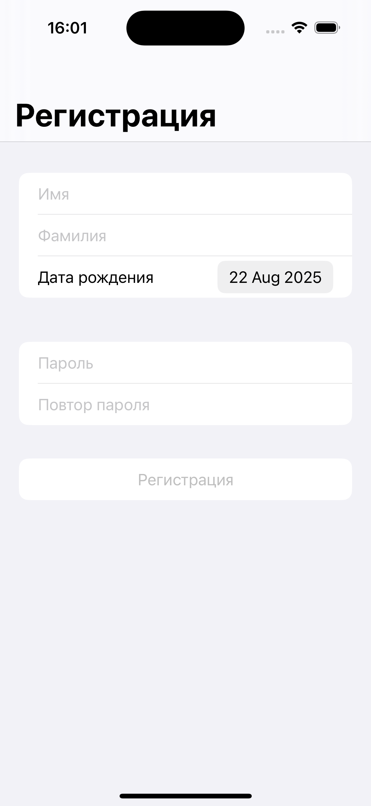
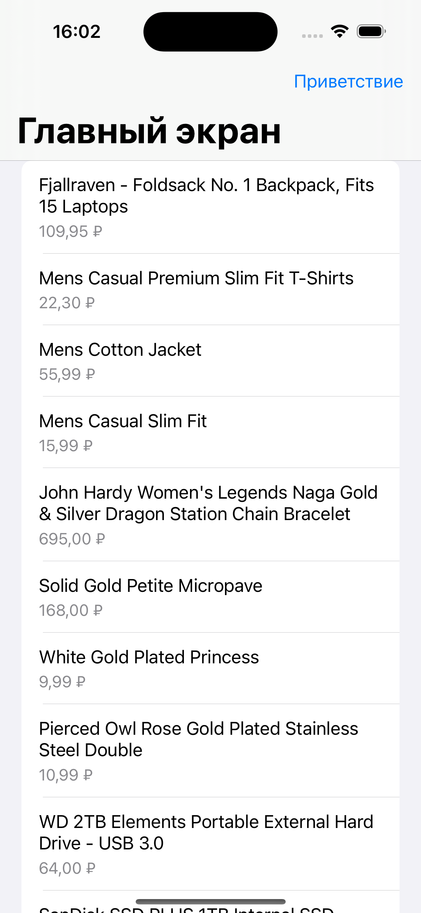
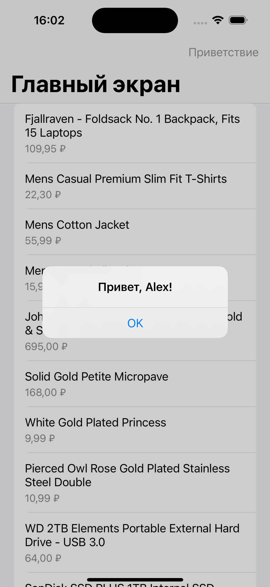

# ShopApp
Магазин + регистрация

## Стек
- Swift 5.10+, iOS 15.0+
- UIKit главный экран
-  SwiftUI регистрация
- Архитектура: MVP + Coordinator, SOLID, Clean
- Сеть: URLSession
- Хранилище: UserDefaults
- Тесты: XCTest

## Скриншоты
| Регистрация | Каталог | Приветствие |
|---|---|---|
|  |  |  |

## Возможности
- Регистрация: имя, фамилия, дата рождения, пароль и подтверждение  
- Валидации: фамилия ≥ 2 символов, пароль содержит цифру и заглавную букву  
- Кнопка «Регистрация» активна только при заполнении всех полей  
- Переход на главный экран после успешной регистрации  
- Имя кэшируется локально, сессия сохраняется между запусками  
- Главный экран: список товаров с названием и ценой, кнопка «Приветствие» с именем пользователя

## API
`GET https://fakestoreapi.com/products`  

## Тесты
- `ValidatorTests` валидатор полей.
- `RegistrationViewModelTests` успешная регистрация и запись сессии.

## Примечане
- Главный экран недоступен без регистрации.
- Сброс регистрации: удалить приложение из симулятора.
